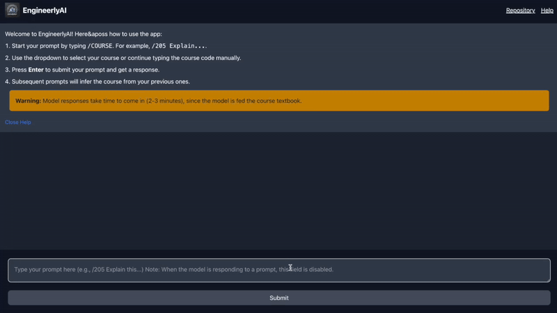

# 🤖 EngineerlyAI

A web-based application designed to provide intelligent tutoring using course-specific textbooks and prompts. It consists of a **Next.js frontend** deployed on **Vercel** and a **Flask backend** deployed on **Google Cloud Run**. The application leverages **Google Generative AI (Gemini)** for generating responses based on user chosen course and prompt.

  

<h3 align="center"><a href="https://pagespeed.web.dev/analysis/https-engineerly-ai-vercel-app/zwoz60o8z5?form_factor=desktop" target="_blank">100 Page Performance Score</a></h2>

## ✨ Features

- **Course-Specific Prompting**: Select a course using a `/course_code` prefix to tailor the AI's response.
- **AI-Generated Answers**: Provides detailed and accurate answers to user queries using textbooks and the Gemini model.
- **Dynamic Dropdowns**: Helps users quickly select available course codes while typing.
- **Responsive Chat History**: Displays user and AI responses in a clean chat-like interface.
- **Automatic Textbook Management**: Uploads textbooks to Gemini periodically for the most up-to-date learning resources.
- **Smart Course Inference**: Detects course textbook to reference based on the first prompt in a chat to reduce prompt redundancy. 

## 🛠️ Tech Stack

### 🌐 Frontend
- **Framework**: [Next.js](https://nextjs.org/)
- **Deployment**: [Vercel](https://vercel.com/)
- **Key Features**:
  - Dynamic dropdowns for course selection.
  - Real-time chat interface with loading indicators for bot responses.
  - Auto-complete and shortcut support for commands.

### 🖥️ Backend
- **Framework**: [Flask](https://flask.palletsprojects.com/)
- **Deployment**: [Google Cloud Run](https://cloud.google.com/run)
- **Generative AI**: [Google Generative AI](https://ai.google.dev/)
- **Scheduler**: Uses `apscheduler` to automate textbook uploads.

## 🚀 Key Functionalities

### 🌐 Frontend
- **Prompt Input**:
  - Use a `/course_code` prefix to select a course.
  - Autocomplete dropdown for available course codes.
- **Chat History**:
  - Displays user queries and AI responses.
- **Help Section**:
  - Toggles a help guide for using the app.

### 🖥️ Backend
- **API Endpoints**:
  - `/submit-prompt`: Accepts user prompts and returns AI-generated responses.
- **Textbook Management**:
  - Textbooks are uploaded to Gemini for AI use.
  - Automatic re-uploads every 1.5 days using APScheduler.
- **AI Model Configuration**:
  - Uses Gemini-1.5-Flash for fast and accurate responses.
  - Safety settings ensure content is appropriate.

## 🧭 Usage

1. **Navigate to the Deployed Frontend**:
   - Open the Vercel-deployed URL in a browser.
2. **Enter a Prompt**:
   - Type `/course_code` followed by your question or statement.
3. **Submit**:
   - Press the "Submit" button to send the query.
4. **View AI Responses**:
   - AI-generated answers appear in the chat history.

## 🛠️ Next Steps

- **Chat History Support**:
  - Enable users to view and retrieve prior conversations within the application.
- **Reducing Model Response Time**:
  - Optimize backend processing and API calls for faster AI-generated responses.
- **Adding Support for More Courses**:
  - Expand textbook integration to cover additional subjects and course materials.
- **Multimodal Support**:
  - Incorporate image, video, and other formats to enrich learning interactions.
